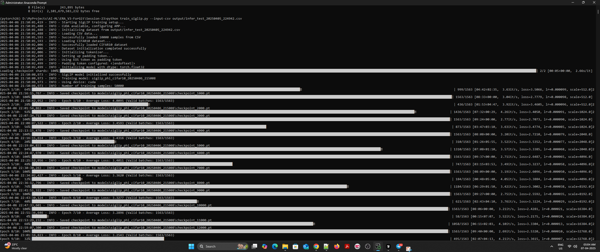
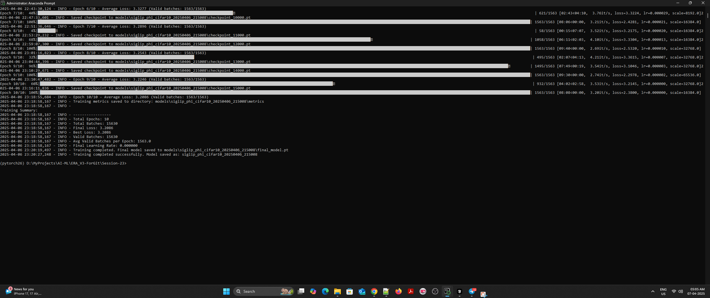
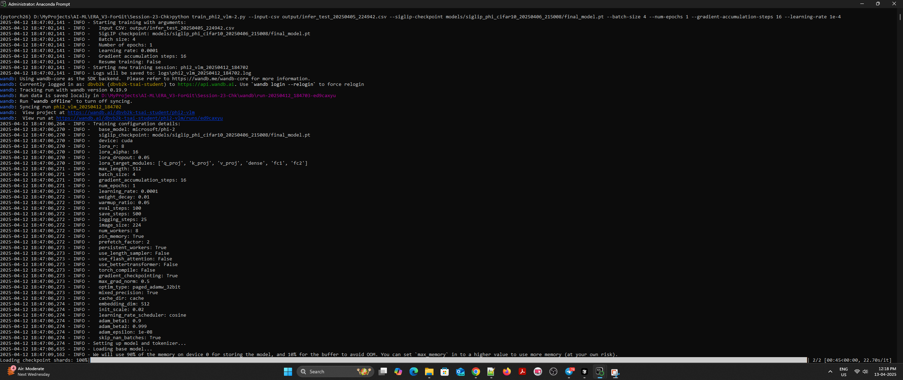
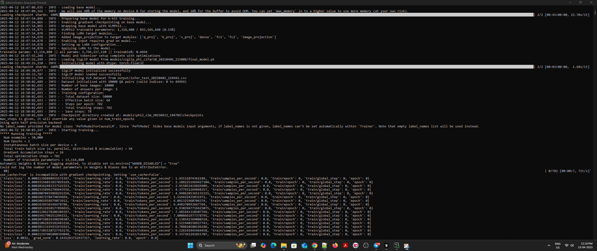
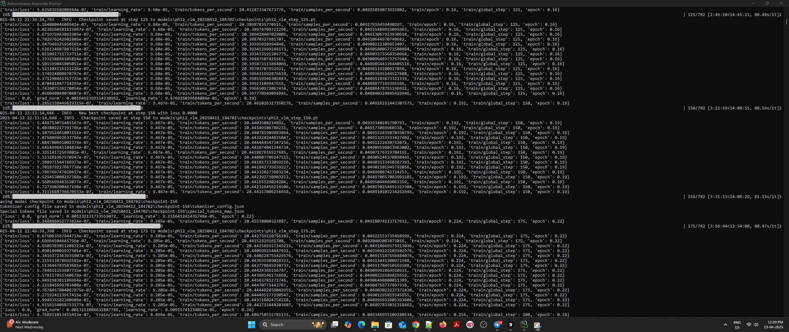
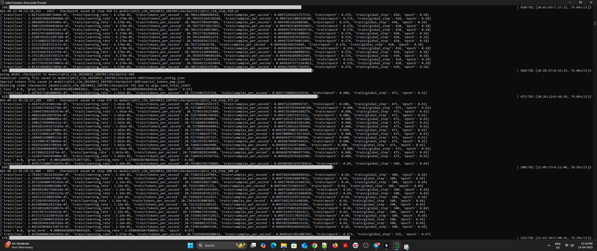
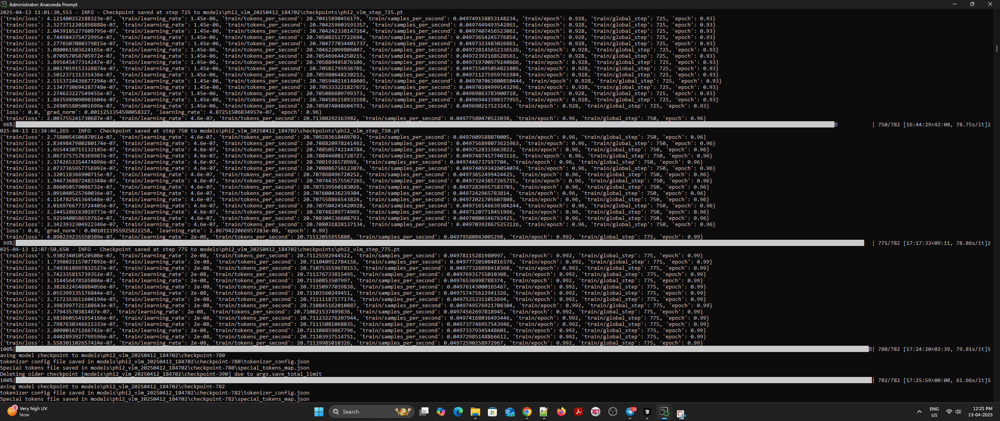
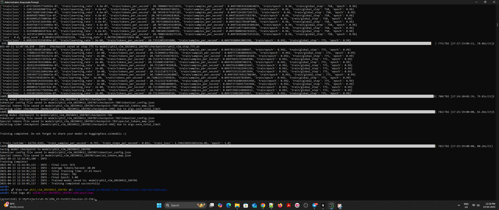

# Vision-Language Model Training Framework

This repository contains a comprehensive framework for training Vision-Language Models (VLMs) specifically optimized for CIFAR-10 image analysis. The project implements a two-stage training approach using SigLIP (Sigmoid Loss for Language-Image Pre-training) and Phi-2 with optimization techniques for efficient fine-tuning.

## Table of Contents
- [Overview](#overview)
- [Project Components](#project-components)
- [Installation](#installation)
- [Dataset Requirements](#dataset-requirements)
- [Training Pipeline](#training-pipeline)
- [Model Architecture](#model-architecture)
- [Optimization Techniques](#optimization-techniques)
- [Training Screenshots](#training-screenshots)
- [Example Usage](#example-usage)
- [Results Analysis](#results-analysis)
- [Performance Considerations](#performance-considerations)
- [Future Work](#future-work)

## Overview

This project implements a multi-stage approach to create a Vision-Language Model capable of analyzing CIFAR-10 images with detailed textual descriptions. The pipeline consists of:

1. **SigLIP Training**: First-stage training to create efficient image embeddings aligned with text representations.
2. **Phi-2 VLM Training**: Second-stage training that uses the SigLIP embeddings to fine-tune the Phi-2 language model with QLoRA (Quantized Low-Rank Adaptation).
3. **Image Analysis**: Inference framework for analyzing CIFAR-10 images using either the trained model or SmolVLM2.

The framework is highly optimized for performance, incorporating techniques like gradient checkpointing, mixed precision training, and Flash Attention 2.

## Project Components

The repository contains the following main components:

- **`train_siglip.py`**: Trains the SigLIP model on CIFAR-10 to create aligned image embeddings.
- **`train_phi2_vlm.py`**: Uses the trained SigLIP model to fine-tune the Phi-2 language model.
- **`smolvlm_cifar_analysis.py`**: Analysis script for CIFAR-10 using SmolVLM2 for benchmarking.

## Installation

### Requirements

```bash
# Clone the repository
git clone https://github.com/yourusername/vision-language-model-training.git
cd vision-language-model-training

# Create a virtual environment
python -m venv venv
source venv/bin/activate  # On Windows: venv\Scripts\activate

# Install required packages
pip install -r requirements.txt
```

### Required Packages

```
torch>=2.0.0
torchvision>=0.15.0
transformers>=4.36.0
peft>=0.7.0
bitsandbytes>=0.41.1
optimum>=1.12.0
flash-attn>=2.3.0  # Optional for Flash Attention 2
wandb
tensorboard
matplotlib
numpy
pandas
tqdm
```

## Dataset Requirements

The training scripts expect a CSV file with the following structure:

- **`Dataset_Index`**: Index in the CIFAR-10 dataset
- **`A1`-`A5`**: Text answers/descriptions for each image

Example CSV format:
```
Dataset_Index,A1,A2,A3,A4,A5
0,"This is a frog","The image shows a green frog","A small amphibian","Frog on a surface","Green tree frog"
1,"Red automobile","A sports car","Vintage red car","Vehicle on display","Shiny red automobile"
...
```

## Training Pipeline

### 1. SigLIP Training

Train the SigLIP model to create aligned image embeddings:

```bash
python train_siglip.py \
  --input-csv path/to/dataset.csv \
  --batch-size 32 \
  --num-epochs 10 \
  --learning-rate 1e-4
```

The SigLIP model uses a ResNet50 backbone with a projection layer that maps to a 512-dimensional embedding space. The model is trained with contrastive loss to align image and text representations.

### 2. Phi-2 VLM Training

Use the trained SigLIP model to fine-tune Phi-2:

```bash
python train_phi2_vlm.py \
  --input-csv path/to/dataset.csv \
  --siglip-checkpoint path/to/siglip_model/final_model.pt \
  --batch-size 16 \
  --num-epochs 3 \
  --learning-rate 4e-4
```

This script uses QLoRA to efficiently fine-tune the Phi-2 model while keeping memory requirements manageable. The model learns to generate textual descriptions based on image embeddings from the SigLIP model.

### 3. Image Analysis

Analyze CIFAR-10 images with SmolVLM2 for benchmarking:

```bash
python smolvlm_cifar_analysis.py \
  --output-dir output \
  --resume path/to/existing/output.csv  # Optional, to resume previous run
```

## Model Architecture

### SigLIP Model

- **Image Encoder**: ResNet50 backbone with a linear projection to 512-dimensional space
- **Text Encoder**: Phi-2 model (frozen) with a linear projection
- **Loss**: Contrastive loss with temperature scaling
- **Training Strategy**: Uses Automatic Mixed Precision for efficient training

### Phi-2 VLM

- **Base LLM**: Microsoft's Phi-2 model
- **Image Encoder**: Pre-trained SigLIP model
- **Adaptation**: QLoRA for parameter-efficient fine-tuning
- **Training Strategy**: Mixed precision, gradient checkpointing, and memory optimization

## Optimization Techniques

The framework incorporates several optimizations for efficient training:

### Memory Optimizations
- **4-bit Quantization**: Uses bitsandbytes for 4-bit quantization
- **Gradient Checkpointing**: Reduces memory usage by recomputing activations during backpropagation
- **QLoRA**: Parameter-efficient fine-tuning with quantization
- **Paged Optimizer**: Memory-efficient optimizer implementation

### Speed Optimizations
- **Flash Attention 2**: Faster attention implementation (when available)
- **BetterTransformer**: Optimized transformer implementation
- **Mixed Precision Training**: Uses lower precision formats for faster computation
- **Data Loading Optimizations**: Prefetching, pinned memory, and persistent workers

### Training Stability
- **Gradient Clipping**: Prevents exploding gradients
- **Learning Rate Schedule**: Cosine annealing schedule for stable training
- **Rank-Stabilized LoRA**: Improves LoRA training stability

## Training Screenshots

Below are screenshots from the training process, showcasing the model's performance and progress:

### SigLIP Training


<br><br>

<br><br>

### Phi-2 VLM Training


<br><br>

<br><br>

<br><br>

<br><br>

<br><br>

<br><br>

## Example Usage

Complete training workflow example:

```
python smolvlm_cifar_analysis.py
```
```
python train_siglip.py --input-csv output/infer_test_20250405_224942.csv
```
```
python train_phi2_vlm-2.py --input-csv output/infer_test_20250405_224942.csv --siglip-checkpoint models/siglip_phi_cifar10_20250406_215008/final_model.pt --batch-size 4 --num-epochs 1 --gradient-accumulation-steps 16 --learning-rate 1e-4
```

